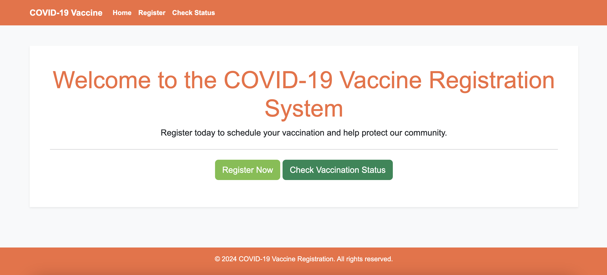

# COVID-19 Vaccine Registration System

This is a **COVID-19 Vaccine Registration System** built using **Laravel**. It allows users to register for vaccination, select a vaccine center, and check their vaccination status. The system already supports email and can easily integrate SMS notifications (via **Twilio**) to remind users about their scheduled vaccination date.



## Table of Contents

1. [Features](#features)
2. [Architecture Overview](#architecture-overview)
    - [Service-Repository Pattern](#service-repository-pattern)
    - [Notifications](#notifications)
    - [Caching](#caching-example)
    - [Redis Integration](#redis-integration)
    - [Supervisor for Queue and Scheduling](#supervisor-for-queue-and-scheduling)
3. [Setup Guide](#setup-guide)
4. [Testing](#testing)
5. [Future Improvements](#future-improvements)
6. [Performance Optimization](#performance-optimization)
7. [Video Tutorials](#video-tutorials)
8. [Conclusion](#conclusion)

## Features

- **User Registration**: Users can register for vaccination by providing their full name, email, NID (National ID), and selecting a vaccine center.
- **Vaccination Scheduling**: Users are automatically scheduled based on first-come-first-serve strategy, considering the daily capacity of vaccine centers. Schedule vaccination only for the weekdays (Sunday to Thursday).
- **Vaccination Status Check**: Users can check their registration status using their NID. The system displays different statuses (`Not Registered`, `Not Scheduled`, `Scheduled`, `Vaccinated`).
- **Email Notifications**: Sends an email reminder to users before their scheduled vaccination date.
- **SMS Notifications (if required)**: SMS notifications can be integrated via **Twilio** to remind users about their vaccination.
- **Redis for Cache and Queue**: Uses Redis for caching active vaccine centers and managing job queues for notifications.
- **Service-Repository Pattern**: Clean architecture for handling the business logic and database operations, ensuring testability and flexibility.
- **phpMyAdmin and Redis**: Included for easy database management and Redis for queue management.

## Architecture Overview

The architecture of this system follows a service-repository pattern and utilizes Laravel’s built-in notification system for email and easy enhancement for SMS notifications.

### Service-Repository Pattern

The service layer manages the business logic, while repositories handle the database interactions, promoting modular and testable code.

- **Services**: Handle business logic and interact with repositories.
    - **VaccinationService**: Manages vaccination scheduling, retrieving vaccination status, and working with repository layers.

- **Repositories**: Provide an interface to the database for different entities.
    - **UserRepository**: Handles user-related database operations.
    - **VaccinationRepository**: Manages vaccination records.
    - **VaccinationCenterRepository**: Manages vaccine centers.
    - **VaccinationCenterCapacityRepository**: Manages the capacity for vaccine centers, ensuring centers don’t exceed their daily limits.

### Notifications

- **Email and SMS Notifications**: Implemented using Laravel's notification system. Users receive email and SMS reminders (not implemented now) about their vaccination schedules. If Twilio credentials are set, SMS notifications will be sent.
- **How Notifications Work**: The system uses a job queue to send notifications asynchronously, ensuring that the main process isn’t blocked by notification sending.

### Caching Example

Caching is used to improve performance by reducing the number of database queries. Here’s how we cache the list of active vaccine centers for 1 day (1440 minutes):

```php
/**
 * @inheritDoc
 */
public function getActiveVaccineCenters() : Collection
{
    return Cache::remember('active_vaccine_centers', 1440, function () {
        return $this->model->where('active', VaccinationCenter::ACTIVE)->get();
    });
}
```

This example caches active vaccine centers, ensuring quicker access to frequently queried data. The cache will automatically refresh after one day.

### Redis Integration

- **Redis for Cache**: Redis is used to cache data like vaccine centers, ensuring faster lookups and reducing database load.
- **Redis for Queues**: Jobs like sending notifications (email and SMS) are handled asynchronously using Redis for queuing, making the application more responsive and scalable.

### Supervisor for Queue and Scheduling

- **Supervisor** is configured to manage both the queue workers and the Laravel scheduler. The queue worker processes jobs like sending notifications in the background, while the scheduler manages recurring tasks.

- **Key Commands Scheduled**:
    ```php
    // Schedule the vaccination reminder job to run every day at 9 PM.
    Schedule::command('vaccination:reminders')->dailyAt('21:00');

    // Schedule the vaccination job dispatcher to run every minute.
    Schedule::command('vaccination:schedule')->everyMinute();
    ```

#### Commands for Scheduling and Notifications

- **Vaccination Scheduling Command** (`vaccination:schedule`): Periodically schedules vaccinations for users who haven’t been scheduled yet.
- **Vaccination Reminders Command** (`vaccination:reminders`): Sends reminders to users scheduled for vaccination the next day.

---

## Setup Guide

### Prerequisites

Make sure you have the following tools installed:

- **Docker**
- **Docker Compose**
- **Git**

### Step 1: Clone the Repository

```bash
git clone https://github.com/shohanjh09/covid-vaccine-registration.git
cd covid-vaccine-registration
```

### Step 2: Setup Environment Variables

Copy the example `.env` file and set up the environment variables:

```bash
cp .env.example .env
```

Update the `.env` file with the following settings:

```env
DB_CONNECTION=mysql
DB_HOST=db
DB_PORT=3306
DB_DATABASE=covid_vaccine
DB_USERNAME=root
DB_PASSWORD=Uhtkjf75rbT8e3

TWILIO_SID=your_twilio_sid
TWILIO_AUTH_TOKEN=your_twilio_auth_token
TWILIO_SMS_FROM=your_twilio_phone_number

# Mailtrap for email testing
MAIL_MAILER=smtp
MAIL_HOST=smtp.mailtrap.io
MAIL_PORT=2525
MAIL_USERNAME=your_mailtrap_username
MAIL_PASSWORD=your_mailtrap_password
```

### Step 3: Docker Setup

Build and start the Docker containers:

```bash
docker-compose up --build
```

### Step 4: Install Dependencies and Generate Key

1. **Install Composer Dependencies**:

```bash
docker exec -it covid-vaccine-app composer install
```

2. **Generate the Application Key**:

```bash
docker exec -it covid-vaccine-app php artisan key:generate
```

### Step 5: Run Migrations and Seed Database

Run the migrations and seed the vaccine centers:

```bash
docker exec -it covid-vaccine-app php artisan migrate
docker exec -it covid-vaccine-app php artisan db:seed --class=VaccineCenterSeeder
```

### Step 6: Compile Assets

Run the following commands to compile the CSS and JavaScript assets:

```bash
docker exec -it covid-vaccine-app npm install
docker exec -it covid-vaccine-app npm run build
```

### Step 7: Clear Config, Cache, and Routes (if needed)
Run the following command to clear config, cache, and routes:

```bash
docker exec -it covid-vaccine-app php artisan config:clear
docker exec -it covid-vaccine-app php artisan cache:clear
docker exec -it covid-vaccine-app php artisan route:clear
```

### Step 7: Access the Application

Once the setup is complete, you can access the application in your browser:

- Application: [http://localhost:8070](http://localhost:8070)
- phpMyAdmin: [http://localhost:8071](http://localhost:8071)

### Step 8: Managing Queues and Scheduler (No action Required as Supervisor managing it)

- To start the queue worker:

~~docker exec -it covid-vaccine-app php artisan queue:work~~

- The scheduler and queue worker are already managed by Supervisor in Docker. No manual intervention is required.

---

## Testing

Run unit and feature tests using PHPUnit:

```bash
docker exec -it covid-vaccine-app php artisan test
```

Manual testing:

- **User Registration**: Register a user for vaccination and verify the registration in the database.
- **Vaccination Status**: Check a user's vaccination status using their NID.
- **Notifications**: Verify email and SMS reminders are sent using **Mailtrap** and **Twilio**.

---

## Future Improvements

- **Performance Optimization**:
    - **Indexing**: Add database indexes for frequently queried fields.
    - **Optimize Queries**: Refactor complex queries to improve performance and reduce overhead.
    - **Additional Caching**: Implement more aggressive caching for user and vaccination data to further reduce database queries.

- **Admin Panel**: Implement an admin dashboard to allow easy management of vaccine centers and vaccination schedules.

- **Load Balancing**: Add a load balancer to distribute traffic across multiple instances of the application.

- **Improved Search Efficiency**: For large datasets, implementing more advanced search strategies or Elasticsearch could significantly boost search performance.

- **Additional Tests**: Currently, the system includes unit and feature tests. Additional test coverage can be added to further ensure stability, especially around edge cases, bulk actions, and concurrency handling.

---

## Performance Optimization

### User Registration and Search Optimization

To ensure the user registration and search features are fast, various strategies can be employed, both on a low and high level:

#### Low-Level Optimizations:
1. **Database Indexing**:
    - Add indexes to frequently queried fields such as `nid` (National ID) and `email` to speed up searches which we did.

2. **Eager Loading**:
    - Use eager loading to avoid N+1 query problems, especially when fetching related data like the vaccine center or vaccination status for a user.

3. **Caching**:
    - Cache vaccine centers using Redis to avoid querying the database for frequently accessed data.
    - Example:
        ```php
      public function getActiveVaccineCenters() : Collection
      {
            // Cache the active vaccine centers for 1 day (1440 minutes)      
            return Cache::remember('active_vaccine_centers', 1440, function () {
                return $this->model->where('active', VaccinationCenter::ACTIVE)->get();
            });
      }
        ```

#### High-Level Optimizations:
1. **Database Sharding**:
    - For large datasets, you can shard the database based on regions or vaccine centers to distribute the load.

2. **Asynchronous Processing**:
    - Move complex registration logic or search operations into the background using queues, especially if integrating external services like SMS or email.

3. **Scaling**:
    - Horizontal scaling can be achieved by setting up multiple instances of the application behind a load balancer to distribute traffic and reduce bottlenecks.

---

## Video Tutorials

### 1. Setup Video

Watch this video to understand the full **setup process** of the COVID-19 Vaccine Registration System using Docker:

[**Setup Video**](https://www.example.com/setup-video-url)

### 2. Feature Demonstration Video

Watch this video to see the complete **feature demonstration** of the COVID-19 Vaccine Registration System, including user registration, status checking, and notifications:

[**Feature Demonstration Video**](https://www.example.com/feature-demo-video-url)

---

## Conclusion

This **COVID-19 Vaccine Registration System** demonstrates a clean and scalable approach to handling user registrations, vaccination scheduling, and notifications. By leveraging Laravel’s notification system, Redis for cache and queues, and the service-repository pattern, the application is designed to be both efficient and flexible. The use of Docker ensures consistent environments, while Supervisor handles background processes like queues and scheduling seamlessly.

